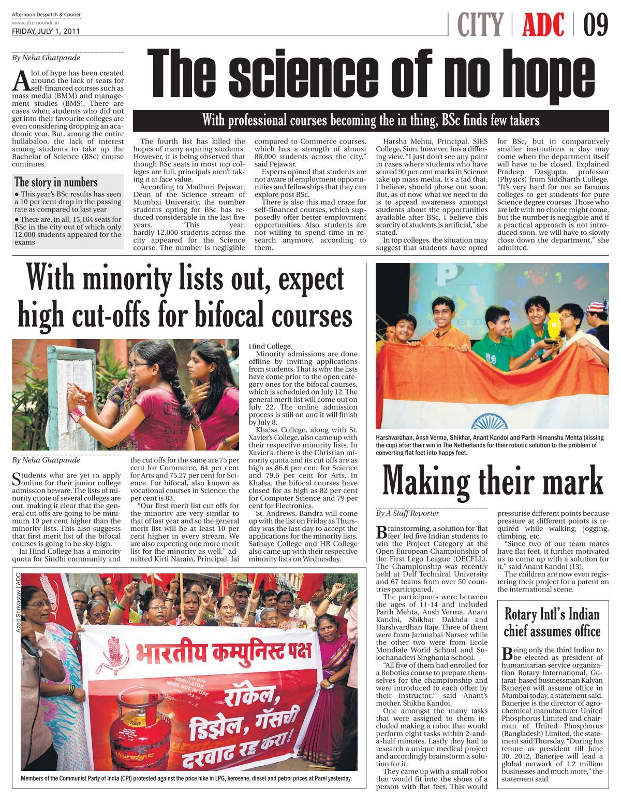

# Harsh Raje

Robotics, Controls, Embedded Software, Experimental Tools

I build systems that cross the usual boundaries: mechanical design, sensor integration, control algorithms, fast prototyping, and software that helps people test ideas quickly.

This site pulls together research prototypes, useful internal tools, racecar experiments, manufacturing ML, and shorter technical notes that used to be scattered across folders, slide decks, Blogspot drafts, and videos.

  

    <strong>Research</strong>
    Ackermann-drive robotics, LiDAR odometry, state estimation, and controller benchmarking.
  

  

    <strong>Engineering</strong>
    Embedded systems, sensing hardware, test benches, and design-for-build workflows.
  

  

    <strong>Software</strong>
    Python tooling, simulation, data pipelines, visualization, and small utilities that stay useful.
  

> I am most interested in work where hardware, controls, and software have to agree with each other in the real world.

## Start Here

  <a class="start-card" href="projects/index.md">
    <h3>Project Deep Dives</h3>
    
Start with the larger technical case studies: racecar localization, manufacturing ML, crack detection, and streaming infrastructure.

  </a>
  <a class="start-card" href="writing/index.md">
    <h3>Writing and Notes</h3>
    
Shorter technical writing on experiments, engineering tradeoffs, and the small tools that keep turning out to be useful.

  </a>
  <a class="start-card" href="experience.md">
    <h3>Experience and Background</h3>
    
Background, roles, and the through-line connecting robotics, controls, embedded systems, and software.

  </a>
  <a class="start-card" href="toys/index.md">
    <h3>Toys and Experiments</h3>
    
Interactive browser-side demos, lightweight sketches, and small prototypes that do not fit the main project pages.

  </a>
  <a class="start-card" href="contact.md">
    <h3>Where Else I Post</h3>
    
External links, archive destinations, and the places where demos, posts, and future public repos will live.

  </a>

## What Is On This Site

- Thesis and research work on LiDAR-only and sensor-fused vehicle localization.
- Machine learning projects connected to real engineering problems, not toy datasets.
- Build logs and technical notes for streaming, instrumentation, automation, and visualization.
- Draft article ideas that can replace the older Blogspot workflow with versioned markdown in GitHub.

## Awards

  

    
    

      
Featured Recognition

      <h3>Open European Championship FLL, Delft</h3>
      
2011 | Best Project Award

      

        Recognition for the project work presented at the Open European Championship FLL in Delft,
        built around water systems, research, and engineering problem-solving.
      

      
<a href="assets/fll-2011-award.jpg" target="_blank">Open award image</a>

    

  

## Patent

  

    
    

      
Published Patent Application

      <h3>Transducive Signal Modulator for Simulated Cardiopulmonary Resuscitation</h3>
      
WO 2026/087546 A1 | Koninklijke Philips N.V.

      

        Named inventor on an electromechanical system that generates realistic CPR-corrupted
        ECG and thoracic-impedance signals on a CPR manikin, producing reproducible synthetic
        data for defibrillator algorithm development and testing.
      

      

        <a href="assets/patent/WO2026087546A1.pdf" target="_blank">Full PDF</a> ·
        <a href="https://patents.google.com/patent/WO2026087546A1/en" target="_blank">Google Patents</a> ·
        <a href="experience.md#patents">More in Experience</a>
      

    

  

## Toys

  <a class="start-card" href="toys/index.md#scrollable-grid-demo">
    <h3>Scrollable Grid Demo</h3>
    
A browser-based interaction toy for placing and navigating pieces on a large grid. This section is ready for more sketches as you surface them.

  </a>

New writing can live directly in this repository. Push markdown to GitHub, and the site can rebuild automatically through GitHub Pages.

