# Sensing for Collaborative Load Transport Report

This page is being rebuilt into a structured web version of the original capstone report, using the original report sections, figures, and wording from the PDF. For the shorter portfolio version, see [the project page](collaborative_load_transport.md).

- [Download the original PDF](../assets/collaborative-load-transport-final-report.pdf)

## Demonstration Video

  <iframe
    src="https://www.youtube.com/embed/JSwahNZB86g"
    title="Collaborative Load Transport Demo"
    style="position: absolute; top: 0; left: 0; width: 100%; height: 100%; border: 0;"
    allow="accelerometer; autoplay; clipboard-write; encrypted-media; gyroscope; picture-in-picture; web-share"
    allowfullscreen>
  </iframe>

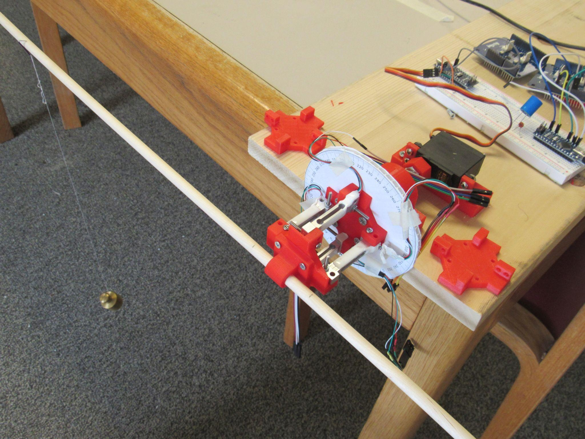

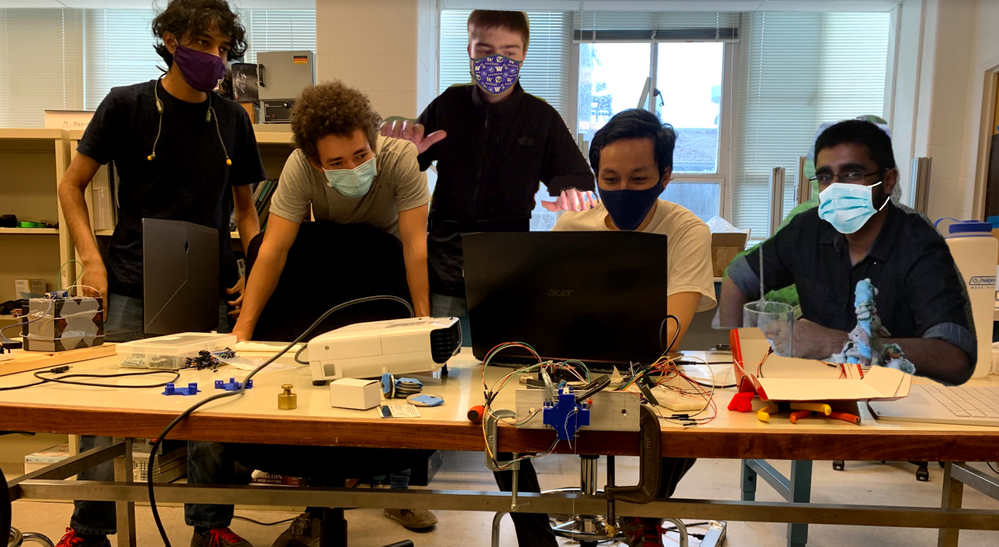

  
Group 2 ME 495  27 June 2021  
Team members (left to right): Harshavardhan Raje, Carlos Sama, Joseph Cooper, Syafiq Khasbullah, Aakash Kurse

## Summary

This project is to create a load cell capable of measuring small forces in 2-D (x and y directions) as well as small torques in the x-y plane. These load cells will be used as control feedback for each of a number of small robots capable of transporting unwieldy and delicate objects collaboratively without subjecting them to excessive stresses. The aerospace manufacturing industry is our primary focus because aerospace manufacturers frequently have to move large uncured composite parts without deforming them. Because many of these load cells will be needed for our application, minimizing the cost of each load cell is a high priority for us.

To meet cost requirements, performance requirements, and time constraints, we chose to use existing off-the-shelf 1-D strain-based load cells for our 2-D load cell and determine our force components and torque from the combination of their readings. These load cells were mounted to a 3-D printed housing and wired to a filter, an amplifier, and a microcontroller. A prototype of our design can be seen in figure 1.

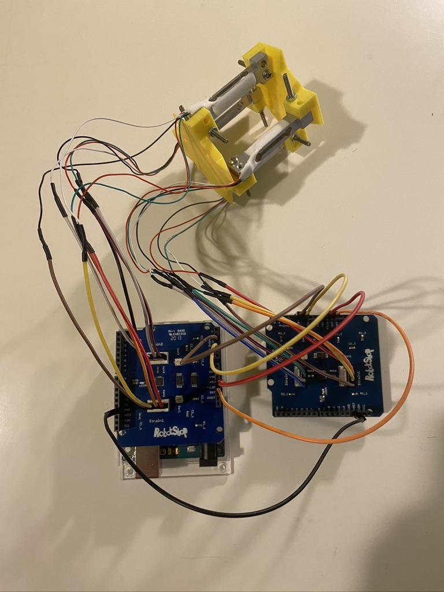

*Figure 1: Load cell prototype*

After several design iterations, we found that this approach does yield useful and accurate results. The tests we used for verification both compared expected force components and torques with the sensor's readings for the same quantities, one under static conditions and one under dynamic conditions. For our latest model, the RMS error for the static loading case was 6.61% for the x-component and 9.63% for the y-component. An earlier model got as low as 0.42% and 1.02% respectively, so we think it's reasonable to assume we can reduce the error from our latest model substantially. We were unable to model torque due to time constraints, but our methods for x and y force components should in theory extend to torque. The sensor collects a data point every 40 milliseconds, though this rate can be increased by removing unnecessary print statements from collection code. The resolution of the sensor force readings is 0.01 N.

## Background

The purpose of the project is to create load sensors for collaborative load transport. The sensors will be mounted on a group of small robots to allow them to autonomously transport a variety of loads with the guidance of a lead robot. They can measure in-plane loads and signal the robots to move accordingly, similar to how a group of people are able to compensate each other when carrying heavy furniture.

## Review of Previous Work

In the field currently bots are being used to transport goods in warehouses, one of the most robust designs being that from Kiva Systems, a subsidiary of Amazon [1]. They use a set of lidars to map the surroundings. However these robots tend to not be able to collaborate to move objects.

They are designed specifically for movement of small packages on shelves, and their close sensing system has capability to avoid obstacles but lacks the capability of collaborating with other robots to transport larger or flexible objects.

There is new research which deals in robots that have the capability to cooperatively manipulate objects. To move larger objects, some researchers have employed a Force-Amplifying N-robot Transport System [2]. In that paper, they have used 3 different types of sensors to estimate the force applied and the pose of the robot.

Conventional 2 axis sensors on the market are expensive and do not have torque capabilities. It is possible to have robots move larger and flexible objects without the use of a pose estimate or inter-robot communication. In a previous paper on this topic a single force sensor was used to minimise deformation [3]. On these same robots that we intend to deploy this sensor, currently it uses a 2 axis load cell setup and a rotation sensor to measure angle. The new sensor is specifically designed to fit the needs of a collaborative transport system. It interpolates the force and torque values without the need for separate systems.

## Application

Large uncured composite parts such as a wing blade panel of an aircraft require specialized transportation: done by a large robot that can only carry that payload. This specialization is very costly especially considering the amount of different composite parts that need their own transportation method in an industry. Thus, collaborative transports may be the adaptive solution for this issue. A group of smaller robots can be adjusted to match the geometry of many variations of composite parts for transportation. The collaborative robots can also be a versatile option for delicate load transport in general. The 1-D prototype mentioned in the previous work demonstrated how the robots can carry a flexible object autonomously as shown in Figure 2 below.

![Figure 2: Flexible-Object Transport with Decentralized Robot Design [3]](../assets/collab-report/page-06-img-01.jpg)

*Figure 2: Flexible-Object Transport with Decentralized Robot Design [3]*

## Main Goals

The main goal is to develop a force sensor prototype to accommodate collaboration between robots to transport a load. Since most multiaxial load sensors in the market can be expensive as mentioned in the previous work section, a more affordable version needs to be made. The sensor design must be able to accurately measure forces in 2-D. The design needs to provide attachment capability onto a robot. Several specifications are defined as guidance to complete the prototype.

**Table 1: Design specifications**

| Specification | Goal |
| --- | --- |
| Load Ranges | ± 5 N |
| Torque Ranges | ± 1 Nm |
| Resolution | 0.01 N |
| Max. Overall Cost | $150 |

The load and torque ranges are small for a small scale prototype and to account for load that deforms easily. The resolution needs to be sensitive enough to get miniscule load measurement to increase accuracy in line with the limitation of a general 10 bit ADC microcontroller. $150 per sensor is a good starting point for experimenting with pieces of sensing components that can be bought from the market at a cheaper price than the average off-the shelf sensor which can cost $200 or more.

## Theoretical Background

A theoretical framework is needed to understand the scope of the project and the interactions between the important components such as the sensors, filters, and microcontrollers. Most of this is relatively simple, but within a system, each theory plays an important role that adds complexity to the final design.

### Strain-Based Load Cells

Strain-based load cells use the property of a metal beam to bend proportionally to a certain amount of applied load within its elastic region. The resulting strain from the bending will elongate an attached strain gauge on the metal by the same amount. Since strain gauges are resistors, their resistances increase with length. As a result, a voltage difference can be generated and processed to measure the applied load depending on the load cell material properties and calibrations of the strain gauges. Typically there are four strain gauges on a single piece of metal beam connected in wheatstone bridge configuration to mitigate the effect of thermal expansion on the force measurement. The beam will be thinner (side-drilled) at the location where the strain gauges are attached to increase the strains upon bending. This theory is detailed in Appendix A.

### Signal Processing

A major gap between theoretical assessment and practical implementation of strain based load cells is the influence of noise and disturbances. Noise can occur from many sources such as power supplies, electromagnetic interference, and local vibrations. Additionally, the issue of aliasing becomes relevant as physical analog to digital converters (ADC) have a finite sampling rate. The combination of random noise and high frequency aliasing can cause poor data to the intended control algorithm which relies on high accuracy, low latency information. Thus to mitigate this noise while maintaining the response of the load cells, signal processing by means of physical filtering and software conditioning must be implemented.

A low pass filter circuit can be used in nearly all applications of electric signal measuring as a way to reduce noise. A common implementation builds a first order circuit through a resistor and capacitor by taking the voltage across the capacitor as the output voltage. Precise selection of the capacitance and resistance enables targeting specific cutoff frequencies, yet it is still necessary to assess the phase delay and response characteristics of the designed filter. In general the filters used were chosen to be half the upstream sampling rate to mitigate any aliasing of higher frequency noise.

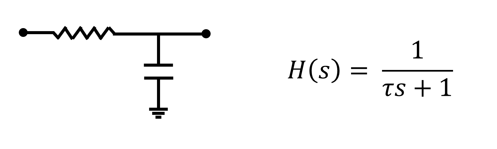

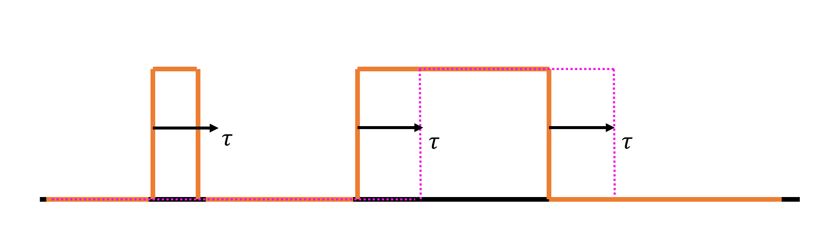

*Figure 3: Low pass filter circuit diagram (left), low pass filter transfer function (right)*

While low pass filters can reduce detrimental noise produced from the sensor, noise and signal bounce introduced by the ADC and power supply cannot be removed through physical filtering. Small, cheap, computer powered microprocessors such as the Arduino Uno introduce such processing noise. While better power supplies and greater amplification can mitigate much of this noise, additional software filtering can be implemented to get the best possible signal. One of such techniques is a debounce filter which delays a change in the signal value unless that change has been maintained for a user-defined time constant, as demonstrated in figure 4. While this filter does delay signal information, a time constant may still be chosen that provides information fast enough for controllers and other processes. In this case fluctuations are greatly reduced.

*Figure 4: Debounce function and time delay*

### Linear Regression

We used statistical methods, specifically linear regression to find an accurate relationship between load cell voltages and forces. Linear regression is essentially the multi-dimensional equivalent of a best fit line, and determines the coefficients in the matrices `A` and `B` to minimize error determined by fitting the data to the relationship:

`(1)`

Where `y` is a vector of output variables, `x` is a vector of input variables, and `A` and `B` are matrices with constant coefficients. The upsides to using this method are that it easily captures linear relationships between input and output vectors without the need to attempt predicting those relationships analytically, and that the simplicity and linearity of the function makes finding `y` given `x` computationally inexpensive. The downsides of this approach is that it may obscure the theory behind the relationships it finds by compacting the entire system model into a matrix, and that it is unable to capture nonlinear relationships between `x` and `y`. For this model to be effective, the true relationship between `x` and `y` must be at least close to linear.

### Pendulum Dynamics

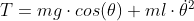

We used a pendulum test to evaluate the load cell's response to dynamic loads because ideal pendulums are relatively easy to model, which means we can easily acquire expected forces over time using an analytical model. This is relevant because the validity of our results is determined by comparing expected and experimental force readings. For our purposes, we made several simplifying assumptions about the pendulum. We assumed no air resistance or damping of any kind, a massless string with a point mass at the end, and a perfectly fixed mounting point. Given these assumptions, the differential equation governing the pendulum's motion is given by:

`(2)`

Where `𝜽` is the angle of the pendulum, `g` is the gravitational constant, and `l` is the length of the string. A numerical equation solver can be used to obtain `𝜽` and its derivatives, which can then be used to obtain the tension in the string `T` using:

`(3)`

Where `m` is the mass of the pendulum. This tension can then be converted into x and y components of force using:

`(4)`

### Sensor Modeling

We made a model of the entire system to help with visualization and organization. We also modeled several parts of our system to assist with sensor design and testing, including force components for loading tests and voltage-to-force calculations.

#### System Dynamics

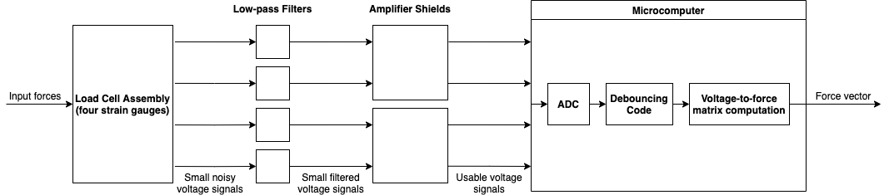

For this project, our system is considered to be everything between forces and torques being applied to the load cell and digital measurements of the forces and torques being sent to a microcomputer. Forces applied to the load cell assembly result in each of our four 1-D load cells experiencing some amount of strain, which is turned into a voltage through use of strain gauges mounted on the load cells. These voltage signals are initially very small and contain high-frequency noise.

To reduce noise and eliminate the possibility of aliasing, the signals are each separately passed through an analog low-pass filter. To raise the voltage signals to readable levels, they are each separately passed through an amplifier. At this point, the voltage signals are usable and can be passed into a microcomputer for further processing. The first thing the microcontroller does is convert the voltages from analog to digital. It then digitally debounces the signals to attempt to further reduce noise. In the final step, the voltages are converted to force components and torque using a calibration matrix obtained using linear regression. A block diagram of the system is shown in Figure 5 below.

*Figure 5: Load cell block diagram*

#### Test Force Modeling

Data collected for calibration has to have both load cell voltage readings and known actual applied forces, because our numerical model is built using the relationship between these two. Voltages can simply be read from the load cell, but known forces can't be accurately measured by an uncalibrated load cell and so must be analytically determined for each of our test cases.

For our case, we used a weight on a string with known mass `m` and used an accelerometer to determine the angle `𝜽` of the load cell with respect to the direction of gravity. With both these quantities known for each data point, we were able to calculate the force components in the x and y directions `Fx` and `Fy` for each data point using a force balance from a free-body diagram:

`(5)`

`(6)`

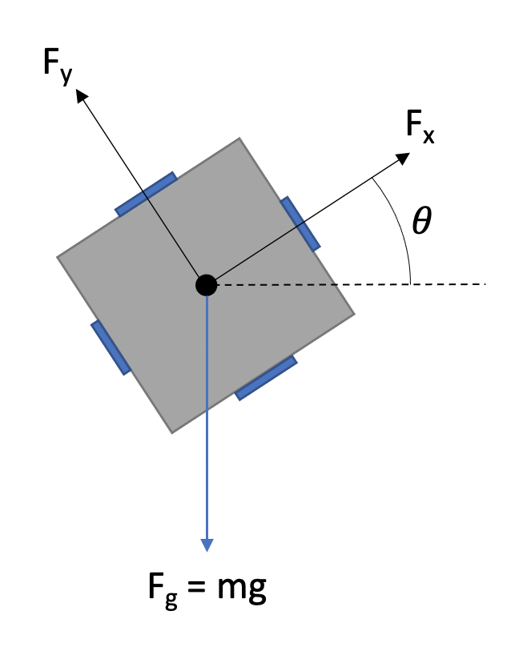

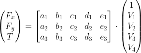

*Figure 6: Free-body diagram of a load cell under static loading*

#### Voltage-to-Force Calculation

Given the complex relationship between forces and voltages along with the time constraints of the project, we opted for a numerical rather than theoretical approach to calibration. To minimize computational expenses, we assumed the relationship between forces and voltages was linear, given by the following matrix equation:

`(7)`

Where `Fx`, `Fy`, and `T` are the x and y components of force and torque, respectively, and `V1`, `V2`, `V3`, and `V4` are the voltages read from each of the 1-D load cells. The voltages are measured in real time, so to obtain the force components and torque, the coefficients of the matrix must already be known. These coefficients can be found using linear regression if a set of data points with known forces and voltages is available. The validity of the regression and our linear assumption can be checked using additional data points with known forces by using the matrix equation to predict forces from voltages, then comparing these predicted forces to the known forces also contained in those data points.

Once the coefficients are found through this calibration process, unknown forces and torques can be predicted by measuring voltages and passing them into the equation above. The equation is simple enough not to require excessive computational energy, and if the load cell is not physically altered in some way, the coefficients should in theory be constants.

While our approach to calibration is numerical and fairly straightforward, there are some challenges associated with it. The biggest challenge from a theory perspective is getting reliable data with known forces and torques. Since the forces we want to measure are small, our load cell is particularly vulnerable to small disturbances. Knowing the orientation of our load cell precisely is also important, because the angle of the load cell relative to applied forces will determine how they are broken up into x and y components.

## Sensor Design

Design of the sensor was split into two major pieces. Mechanical design has to do with all the physical components of the sensor, such as load cell geometry, component and material choices, and physical modeling. Electrical and software design has to do with anything related to electronics or code, such as filtering, amplification, and voltage-to-force computations.

### Mechanical Design

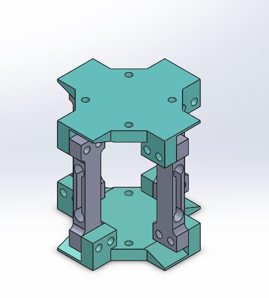

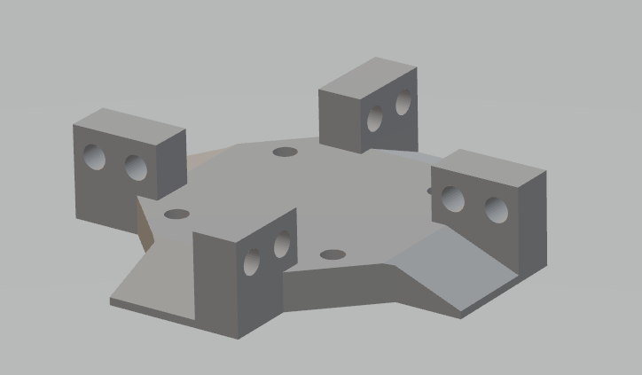

The 2 axis and torque load cells took advantage of premade single axis load cells that already have calibrated strain gauges. By mounting four premade load cells in a square configuration, we are able to read the load along two axes and we would be able to find the torque applied to the load cell by comparing the output readings of the strain gauges.

*Figure 7: CAD of the Load Cell Assembly*  
*Figure 8: Baseplate of the Load Cell*

For a design to measure load in 2 axes, logic would dictate that we must only have 2 load cells. However, this would introduce a challenge where the load cell would have different dynamics in the 2 axes. This is because the center of the moment would shift under load. To combat this we have developed a design that is rotationally symmetric. This symmetry gives us 2 data points for the load in each axis, allowing for collaborative filtering. Secondly, this setup allows us to measure torque. The rotational symmetry constrains the center of moment, keeping it on the central axis between load cells which implies that all load cells undergo the same loadings. This means that the reading from each sensor could be compared to estimate torque.

The mechanical aspects of the design had two problems throughout the design phase. Initially, the PLA base plate made it very difficult to attach the load cells without shearing off the wires that were attached to the single axis load cells. In order to remedy this issue, as seen in Figure 8, 45° chamfers were added to the baseplate in order to reduce the bend angle of the wires when constructing the sensor. The second revision to the design was using one screw in each of the mounting brackets of the baseplate, which was done in order to reduce the amount of interplay between the x and y axis due to mechanically over-constraining the system. Additionally, the extra screws meant that the total spring constant of the sensor increases, which means for the same load, the force seen decreases and the voltage reading diminishes. The screws act as rudimentary bearings that allow the load cell to rotate instead of bending in the direction perpendicular to their direction of sensing.

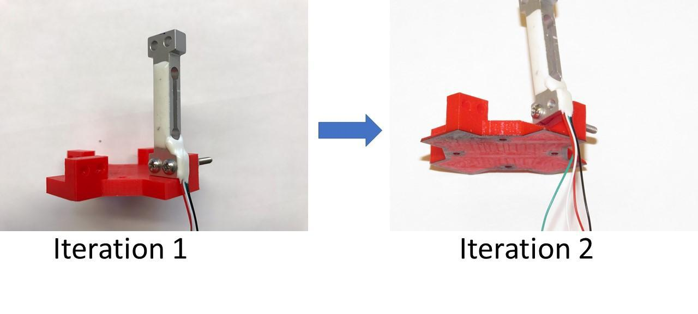

*Figure 9: Baseplate design iterations*

The driving factor in our component selection was cost, which was why we chose cheap single axis load cells, PLA, and a commercial amplifier, as well as using Arduino integration for the entire system.

### Electrical and Software Design

#### Controller Design

For data acquisition an Arduino microcontroller was utilized. This board was chosen due to its easy interface, familiarity, and ability to sample at the predefined required rate. In addition to the Arduino, a RoboShop shield amplifier was coupled to the Arduino and served as the interface between the controller and the load cells. The amplifier sat directly on top of the arduino and amplified the signal by a gain of 500. Open source libraries were available to read the amplifier output signal from the Arduino's ADC. These readings could then be plotted in real time and passed through the software filtering scheme.

#### Amplification and Gain Selection

The gain in our current system is constrained by our choice of amplifier shield. This shield has the AD8426 as the instrumentation amplifier. Its gain is regulated by the gain resistor `Rg`.

The default provided by the manufacturer is a 100 Ω resistor. This means that the gain set by the manufacturer is 500 [4].

The Analog to Digital port on the processor wasn't saturated to its maximum and minimum allowable voltages. Thus it is safe to assume that increasing the gain will not push the rest of the sub-systems beyond their working limit. For the AD8426 gain is given by [4]:

`(8)`

This implies that if we reduce to 50 Ω, the gain will be 989. To do so, the shield was fitted with a second 100 Ω resistor in parallel with the provided.

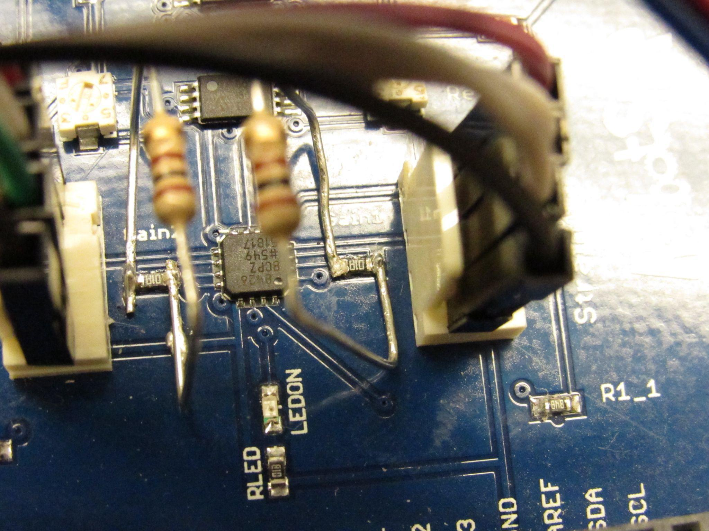

*Figure 10: 100 Ω resistor soldered in parallel to `Rg`*

As a result the peaks seen in the voltage readings have been much higher. This modification was specifically made for the sensor mounted on the robot, requiring a separate calibration table. This modification leaves the shield vulnerable to damage by tugging.

#### Filtering and Debouncing

The raw voltage response of the load cell on its own provides a reasonable input to the control algorithm; however, amplification and filtering was necessary to extract the most information and the cleanest information from the load cells. Several systems are put in place to amplify and filter the data, the first of which is the RoboShop shield amplifier. The amplifier shield has been fitted with a low-pass 2nd order Bessel filter at 1000 Hz for both channels after the instrument amplifier before it is read by the Arduino Analog input [4]. This amplifier has a gain of 500 which produces a greater voltage range of the readings and thus more information for the ADC to pick up. This specific amplifier was chosen as it interfaces directly with the Arduino processing board chosen to be the DAQ, and can support two load cells.

The initial set up of a single load cell wired to the amplifier was tested by applying random loads and visually inspecting the response. At first, a lot of noise appeared and large spikes appeared around dynamic loading events. To reduce these characteristics, a low pass filter was designed along with a debounce algorithm.

The low pass filter was designed as a first order system consisting of a capacitor and a resistor. The cutoff frequency was decided to be one half of the Arduino's sampling rate to prevent any aliasing of higher frequency signals, reduce high frequency noise, while still allowing a fast response of the load cell readings. The selected components were a 3.3uF capacitor and a 330 ohm resistor. This design was simulated in MATLAB to present the frequency response and step response expected of it as presented in Figure 11. In order to validate the filter on the physical hardware, a step down test was performed by applying a random load and quickly releasing it. This test was also performed on the standard no filter case and on a filter with a very low cutoff frequency. The results showed that the low pass filter was able to remove the spikes around dynamic loading events without hindering the response time. The signal conditioning and response characteristics are shown in Figure 12 which compares the unfiltered signal to a filtered signal to a heavily filtered signal.

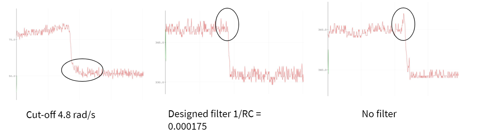

*Figure 11: Filter frequency response*

Figure 12: Tested frequency response of heavily filtered system (left), designed filter (center), and no filter (right)

Despite implementing a low pass filter, the bouncy singal readings were still appearing. While the root cause for this bounce is still unknown, we suspect that the power supply to the board (a personal computer) is giving an inconsistent and bouncy reference for the ADC readings. So, to reduce this bounce, a debounce algorithm was implemented to be run live with data collection. The algorithm functions to ignore any spikes or deviations from its initial value if these deviations last for less than a defined time duration. But when a load is applied, and the baseline value changes, that change will outlast the debounce duration and a new initial reading is set. The algorithm was coded and tested in MATLAB and was capable of reducing the jitter in the signal while still providing quick and accurate readings as shown in Figure 13. It was then implemented on the hardware using the code found in Appendix B6 and has been used to reduce the levels of bounce in the signal.

#### Programming and Interfacing

The load cell must be calibrated to get meaningful force measurements from it. When equipped with an accurate calibration matrix, a microcontroller can be used to obtain force components from voltage readings in real time without too much computing power. The Arduino code for reading and transmitting force components can be found in appendix B.5.

The microcontroller stores the calibration matrix from equation 7. The coefficients of the matrix can be found using MATLAB's built-in linear regression function `fitlm` and a selection of data points with known forces and measured voltages. Raw voltage and angle data was acquired and debounced using Arduino code, which can be found in appendix B.6. This data was then manually cleaned up and run through a MATLAB post-processing script designed to assign known forces to each data point and find coefficients for the calibration matrix through linear regression. This MATLAB calibration code can be found in appendix B.4.

After finding these coefficients, we can simply take the matrix found in MATLAB and insert it into our Arduino code to compute forces in real time. This matrix is likely to be different for each load cell made and may change if the load cell is altered in any way. Thus, the MATLAB regression script has been designed to be used repeatedly on different sets of data. Ideally, the time required to calibrate each load cell would be reduced to just the time needed to collect testing data, and test data collection would also be automated to further reduce calibration time.

Once force components and torque are determined, they can either be acted on directly by the same microcontroller that computed them or sent to a separate microcontroller for other uses. In our application, whichever microcontroller is responsible for driving the chassis of a given robot will attempt to drive the chassis in such a way that the forces and torques are minimized.

Some Arduino code was also required to drive a servo for testing, and an additional MATLAB script was used to predict "known" forces for dynamic pendulum loading. Both of these are included in appendices B.7 and B.1 respectively.

## Experiments

Several experiments were planned for this project to help inform the design process and validate the accuracy of the final product. In our case, the experiments were conducted in sequence, with each experiment being dependent on the previous one. Each experiment has its own goals, setup, and procedure, and is broken up into planning and execution sections here.

### 1-D Static Loading

#### Planning

This experiment consists of applying static known forces in one direction to a single 1-D strain gauge. The goals of this experiment are as follows:

- Get a general estimate of each 1-D load cell's sensitivity, ratio of force in to voltage out, to help us decide on an adequate amplification factor for our voltages to reach the full-scale reading of our analog-to-digital converter.
- Determine noise characteristics of the signal such as noise frequency, consistency, and amplitude, to help us design an appropriate filter to minimize this noise.
- Examine accuracy and repeatability of measurements and vulnerability to small disturbances to make sure these strain gauge-based load cells will meet our design requirements.

The planned procedure is as follows:

1. Connect a single load cell to the amplifier shield. The amplifier is then attached to the Arduino microcontroller.
2. The microcontroller is connected to a computer with the code program to run the load cell and acquire data in Arduino software.
3. Open Tera Term software and prepare for data collection from the microcontroller.
4. Mount the load cell horizontally at the side of a table and hang a string with a hook off the front of the load cell.
5. Incrementally add weights of 0.1 lbs to the hook, taking data each time once the load has settled.
6. Save the data for further analysis in MATLAB.

#### Execution

Executing this test required several main pieces of hardware in addition to the strain gauge. An L bracket was utilized in order to create a fixed mounting for the load cell. Additionally, sets of washers weighing a collective 0.1 lbs were organized to be applied as known incremental loads. A hook was created to hang these loads and they were applied from a zero case to 0.1 overall load, 0.2 overall load, and so on. The steady state readings from the test strain gauge were recorded and further processing was performed in MATLAB. The recorded data was averaged for a single measurement for each loading case. This data was used to test the linearity of the strain gauge response and find the calibration coefficient. Experimental setups are shown in Figure 14 below.

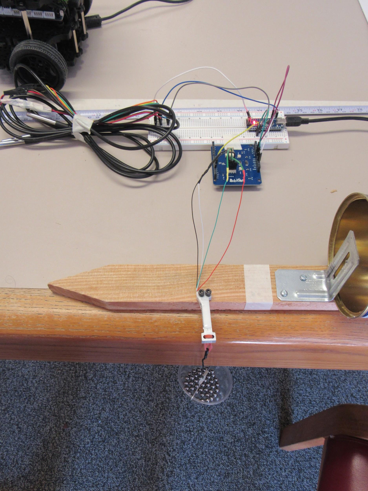

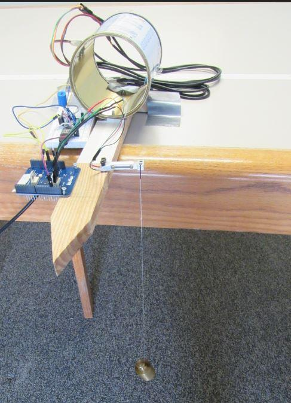

*Figure 14: 1-D load cell, ball bearing test and calibration*

### 2-D Static Loading

#### Planning

This experiment consists of applying static known forces and torques in a variety of directions to the complete load cell, including all four 1-D load cells. The goals of this experiment are as follows:

- Observe and analyze the general shape of responses to gain insight into how each load cell is being loaded and to make sure all load cells are still reading in a stable and reliable manner even with the load divided between them.
- Collect a large number of data points that contain both the known forces and torque applied and the four voltage readings, to be used to calibrate the load cell using linear regression.

The experimental setup is as follows:

- To ensure repeatability of the loading for each direction the setup is mounted to a rotating platform.
- This platform is connected to a servo motor with an acceleration sensor to control the precise angle of the loading. As a visual aid to verify accuracy of the angle a disk with the precise angle is stuck to the back of the platform.
- This entire setup is then mounted to the table using C clamps.
- A separate microcontroller with an independent power supply is used to ensure the noise from the servo motor does not affect the readings from the load cell.

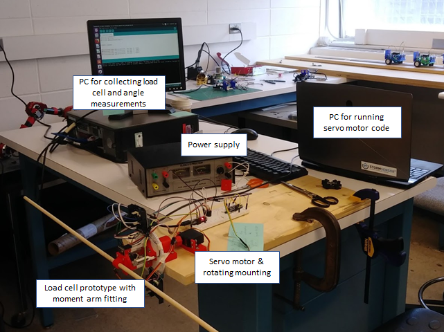

*Figure 15: 2-D static loading setup*

The planned procedure is as follows:

1. Assemble four load cells onto the PLA support.
2. Connect each pair of load cells to an amplifier shield.
3. Connect the amplifiers and an accelerometer to the Arduino microcontroller.
4. Mount the load cell setup to a servo at the side of a table.
5. Connect the microcontroller to a computer that runs the arduino program and open a serial communication software like Tera Term or Putty for data collection.
6. Program the servo to rotate slowly by 2° at a time to 180°. Once it reaches 180°, it will reverse the rotation back to 0°.
7. Collect data for a zero load case while the servo is running twice, once before and once after all the runs. Save that data.
8. Run the same data collection with hanged loads of 0.2, 0.3, 0.5, and 1 lb mass at the tip of the load cells setup. Save these data sets.

#### Execution

To perform the experiment we mounted the sensor on a bearing-supported rotating platform so that it rotates freely. The rear end of the axel is then mounted to a MG995 servo motor. The sensor and its amplifiers are then connected to an Arduino Nano separate from the Nano used to control the servo. The sensor's Arduino Nano is connected to a host computer via serial COMS send and receive data. We hit log on Tera Term and then instruct the motor to swing between 0 and 180 degrees. This recorded data is then uploaded to a cloud service for security. We didn't get the chance to do testing with our torque rod in place, but were able to collect relatively clean data for a variety of zero-torque loading cases. The data we collected did require some extra cleanup, especially for angle measurements, which was done in MATLAB.

### 2-D Dynamic Pendulum Loading

#### Planning

This experiment consists of applying dynamic known forces in a variety of directions to the complete load cell, again including all four 1-D load cells, using a pendulum, which can be easily modeled to determine what applied dynamic forces should be. The goals of this experiment are as follows:

- Observe the general shape of the response and analyze it to gain insight about any issues with our setup and check parameters like response time and hysteresis.
- Record voltage readings with timestamps, convert these voltages to forces using the calibration for 2-D static loading, and compare these forces to the modeled expected forces. We cannot directly check the validity of our work, but if the experimental and analytical forces match closely, we can be fairly certain the design is functioning well.

The planned procedure is as follows:

1. Use the setups from the 2-D static loading experiment.
2. Connect the microcontroller to a computer to run the Arduino program and Tera Term.
3. Hang a pendulum made from 0.5 lb load attached to a 45 cm string.
4. Collect static load data for that pendulum for about 10 seconds. Save the data.
5. Setting the start angle at 45°, release the pendulum.
6. Collect the data for this loading case and save it after 10 seconds.

#### Execution

The pendulum test used the setup for 2-D static loading test for comparison with a simulated force in the x and y direction of the load cells loaded with a pendulum. During the test, the accelerometer was not used due to some technical issues with the Arduino Nano connections to the computer so the pendulum initial rise angle was manually set using a phone application that can estimate angle from horizontal plane as reference. Afterward, the pendulum was released and data was collected. Unfortunately, timestamps were not present in the collected data, so the comparison between experimental results and simulation plots had to be qualitative rather than quantitative for this test.

### Experimental Application

#### Planning

This final experiment is essentially a stress-test of our design. It consists of mounting our load cell to a robot programmed to move to minimize force readings, connecting the load cell to a long flexible spring, and pulling on the spring to observe the robot's response. The goals of this experiment are as follows:

- Check to see if the robot effectively minimizes forces acting on it. If it does, our design is further validated. If not, we may be able to gain some insight into any issues that still remain with our design.
- Check for any obvious control issues such as lag time that may be mitigated with changes to our design.

The planned procedure is as follows:

1. Assemble the load cells, amplifiers, and microcontroller onto a robot.
2. Connect the microcontroller to a computer and upload the load cell program.
3. Gently push the load cells in any direction with the serial monitor on.
4. Verify the resulting forces in the x and y direction shown on the screen to match the expected forces intuitively.
5. Upload the force minimization program, written by Yoshua, for the motor to react to input forces from the load cells.
6. Start the program and gently push the load cells on the robot. Observe the robot's reaction.
7. Attach one end of a foot long spring with ¾ inch diameter on top of the load cells.
8. Manipulate the other end of the spring to simulate a movement of a lead robot and observe the reaction of the robot.
9. Adjust the programmed code as necessary to achieve the desired response upon observations.

#### Execution

The test was carried out using two different types of load transmitters. First one was a relatively stiff rod, and the second one was a wire spring that was attached to a handle. The robot responded to both types of inputs, but took significantly longer to register the loads from the wire spring. A video demo of these experiments is linked in Appendix D. This was most likely caused by the length of the spring and the oscillations that the spring had as it was moving through the loads provided, and there is further room for study in how to ameliorate the effects of a more elastic component.

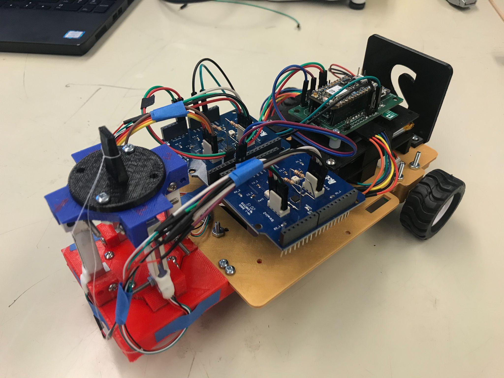

*Figure 16: Robot mounted sensor demo set up*

## Results

### 1-D Static Loading

The 1-D static loading case was primarily performed to get a baseline assessment on the functionality of the strain gauge elements. The primary output was thus a calibration coefficient and the associated error. Using a linear regression fit, a coefficient of 2.1 grams per ADC reading was determined with a least square error of 3.2 grams, or 3.2% of the test range. The curve is shown in Figure 17.

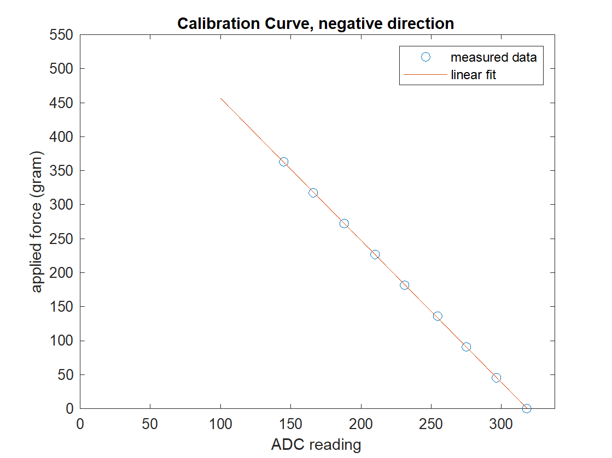

*Figure 17: Collected 1-D loading points and linear model of best fit*

### 2-D Static Loading

Our initial setup for this experiment verified that we were getting reliable readings from all four load cells, and at least qualitatively matched our general predictions for how each load cell would react in a given orientation. We recorded voltage and angle data through a range of angles for each of several constant weights applied to the load cell and converted measured angles and weights to force components. Some of this data was used to model the voltage-to-force relationship using linear regression, while the rest was used to validate the model. We performed this test twice, once with rotating angles and untared load cells and once with fixed angles and tared load cells. A summary of the results from each test is provided here, and each test is discussed in more detail below.

**Table 2: Load cell error and range from testing methods**

| Metric | Rotating angle test | Fixed angle test |
| --- | --- | --- |
| RMS %, Fx | 0.42% | 6.61% |
| RMS absolute value, Fx | 0.037 N | 0.060 N |
| RMS %, Fy | 1.02% | 9.63% |
| RMS absolute value, Fy | 0.091 N | 0.087 N |
| Loading range tested | ± 1 lb (approximately 4.5 N) | ± 0.2 lb (approximately 0.9 N) |
| Taring implemented | no | yes |
| Constant term magnitude | large | small |

#### Rotating Angle Test

For our first attempt, we used a servo to slowly rotate the load cell and obtained relatively clean data for a wide range of angles and several different constant load magnitudes. We unfortunately didn't have taring implemented for this test, so our results were a good proof of concept but weren't repeatable and as a result were not used for our final demonstration. We also realized that the characteristics of the load cell could change when it was moved from our rotating testing setup to the robot, further decreasing the usefulness of any calibration matrix we obtained with it. Nonetheless, our model for this case provided fairly accurate force predictions within the set of data we collected for it, which we think could be repeated for more useful situations if taring were applied.

Because the load cell was oriented horizontally in this test, it added an additional unknown weight to our loading which wasn't accounted for by our model. To handle this, we wrote code to minimize the model's error by adding a constant weight, the extra weight of the load cell, to all loading cases. The extra weight we obtained as a result of this process was 0.090 lbs, approximately 0.4 N, which is reasonable given the size and mass of the load cell.

On a range of ± 1 lb, approximately 4.5 N, the RMS error for validation plots was 0.037 N and 0.091 N for x and y force components, respectively. This corresponds to normalized RMS errors of 0.42% and 1.02% for x and y, respectively. This error is of course obtained under highly controlled conditions, but it indicates our linear regression model is very capable of predicting force components at a variety of angles and load magnitudes. The linear regression matrix derived from this test is shown below, and correlates forces in lbs to voltages, which are recorded as whole digital numbers from 0 to 1023 due to ADC conversion.

**Table 3: Rotating angle calibration matrix**

| Row | c0 | c1 | c2 | c3 | c4 |
| --- | --- | --- | --- | --- | --- |
| 1 | -3.318975 | 0.004472 | -0.002356 | 0.007477 | -0.002696 |
| 2 | -8.053290 | 0.000334 | -0.000267 | 0.003433 | 0.012797 |
| 3 | 0.000000 | 0.000000 | 0.000000 | 0.000000 | 0.000000 |

The third row of the table here is for torques, which were not tested for here and can be ignored for this case. As we can see from the voltage coefficients, all of which are within a couple orders of magnitude of each other, the four load cells are strongly coupled, with force components and torques being highly dependent on the readings from all four load cells. We also see that the constant terms are relatively large, which is likely due to the lack of taring. Plots of validation data, including both the expected load and the model's experimentally predicted load, are shown for x and y force components in Figures 18 and 19. Both of these figures simply plot load magnitudes for a series of data points, so the x-axis of these plots is simply the data point's index.

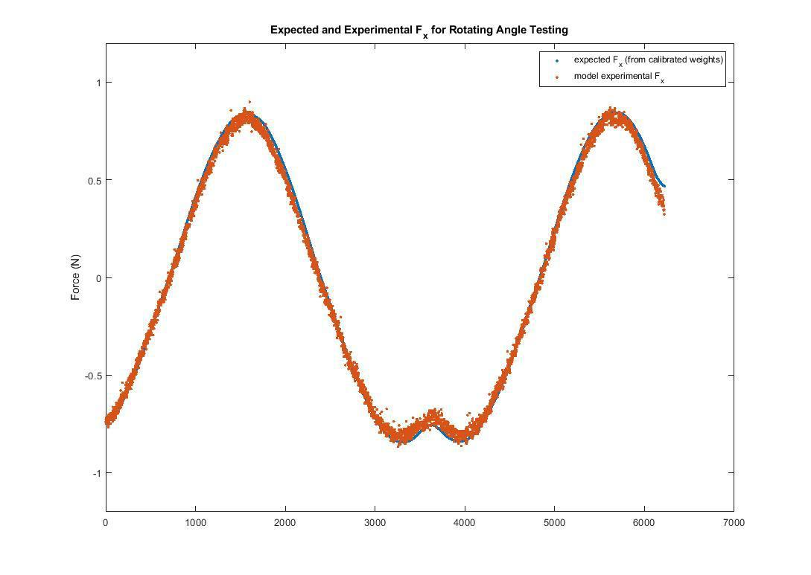

*Figure 18: Expected vs. experimental force, x-direction, for rotating angle static loading*

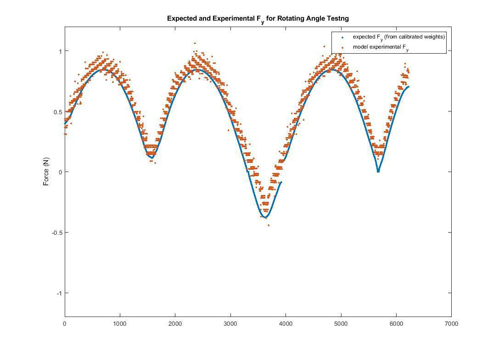

*Figure 19: Expected vs. experimental force, y-direction, for rotating angle static loading*

#### Fixed Angle Test

Our second attempt at performing a 2-D static loading test built on what we'd learned from the initial attempt. We implemented taring for repeatability, and we carried out the test with the load cell already mounted to the robot so as not to alter its characteristics when moving it. Due to time limitations, we weren't able to perform this test with a servo and rotating angles like with the previous one. Instead, we recorded data at a series of fixed, known angles. This gave us a more limited set of data to model from, but did allow us to implement our model in a robot for our final demonstration.

It should be noted that for this test, though the load cell was oriented vertically, the error minimization code for finding additional load cell weight was still used. We expected an additional load cell weight close to zero because the vertical load cell should not contribute additional weight to the load. The error minimization resulted in an additional load cell weight of -0.018 lbs, approximately 0.08 N, which is substantially smaller than for the rotating angle case. This lined up fairly well with our prediction of zero additional weight, and further validated our use of error minimization as a method for determining the additional weight of the load cell.

On a range of ± 0.2 lb, approximately 0.9 N, the RMS error for validation plots was 0.060 N and 0.087 N for x and y force components, respectively. This corresponds to normalized RMS errors of 6.61% and 9.63% for x and y, respectively. This error is much higher than for the rotating angle test, probably because we have less unique data points to model with. It is likely possible to decrease this error substantially with additional data. The linear regression matrix derived from this test is shown below, and correlates forces in lbs to voltages, again recorded as whole digital numbers from 0 to 1023 due to ADC conversion.

**Table 4: Fixed angle calibration matrix**

| Row | c0 | c1 | c2 | c3 | c4 |
| --- | --- | --- | --- | --- | --- |
| 1 | 0.012639 | 0.000911 | -0.000841 | 0.000222 | 0.000553 |
| 2 | 0.005734 | 0.001032 | 0.000146 | -0.000594 | -0.000448 |
| 3 | 0.000000 | 0.000000 | 0.000000 | 0.000000 | 0.000000 |

Again, the third row of the table here is for torques, which can be ignored for this case. The four load cells are still strongly coupled, with all voltage coefficients being within an order of magnitude of each other. In this case, the constant terms are notably much smaller, which is what we would expect given that we used taring in this case. Plots of validation data, including both the expected load and the model's experimentally predicted load, are shown again for x and y force components in Figures 20 and 21. For this case, we used two runs for validation, which is why two distinct horizontal lines are seen.

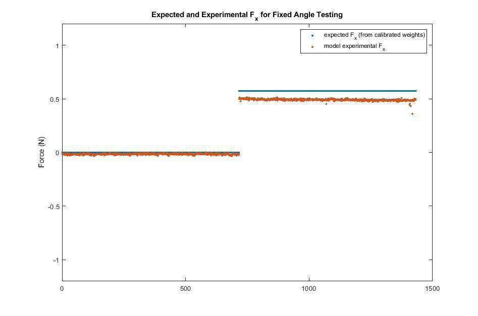

*Figure 20: Expected vs. experimental force, x-direction, for fixed angle static loading*

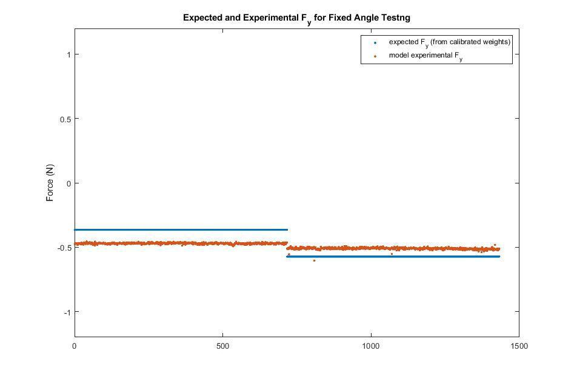

*Figure 21: Expected vs. experimental force, y-direction, for fixed angle static loading*

### 2-D Dynamic Pendulum Loading

The pendulum test enabled a direct comparison of a theoretical loading case to what was experimentally measured. However, due to the lack of information capable of being recorded during the test execution, the comparison between the theoretical pendulum model and the data provided by the load cells had to be performed qualitatively.

Within the experiment, the lacking information included angle of the pendulum and time data. Additionally, a calibration matrix was not established, neither were the load cell offsets tared. Instead, a principal component analysis was used to resolve the `Fx` and `Fy` measurements from the four load cell readings. This method also reduced noise in each measurement as the underlying singular value decomposition resolved the covariance between each data set to a minimum. The two largest singular values and corresponding vectors then represented `Fx` and `Fy`.

Along with the interpreted measured data, the model had a few inaccuracies as well. The model assumed a frictionless system with no air drag, thus results past a few seconds won't compare well. But comparison of the first five seconds from the model and measured data shows a clear correlation of similar patterns as demonstrated in Figure 22.

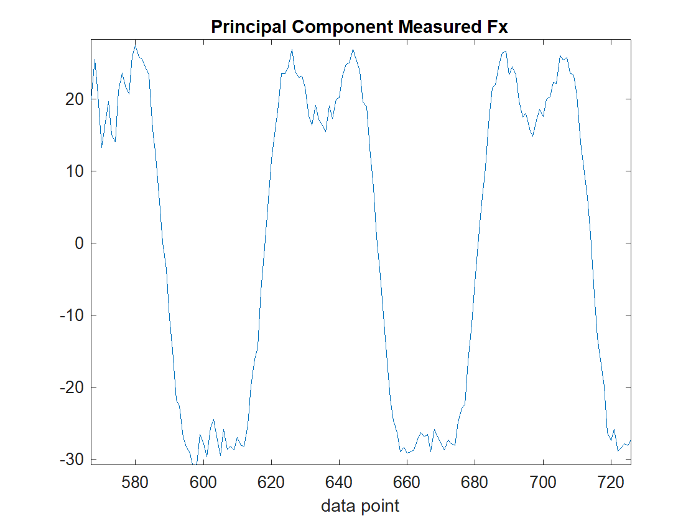

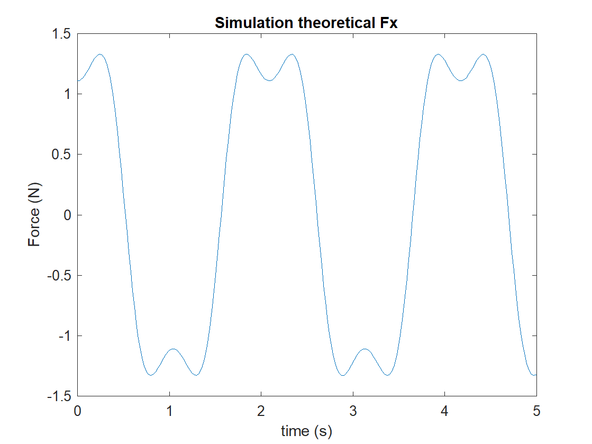

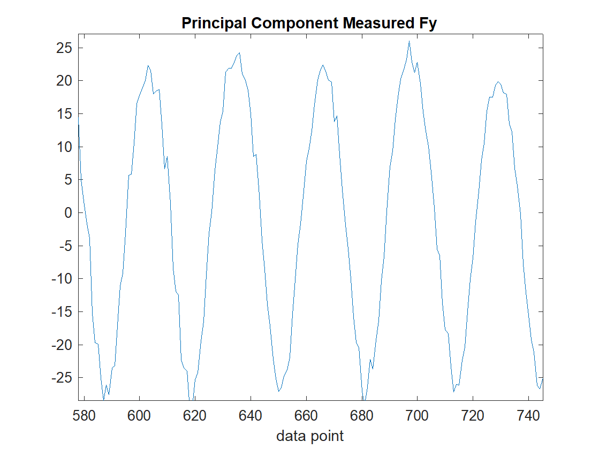

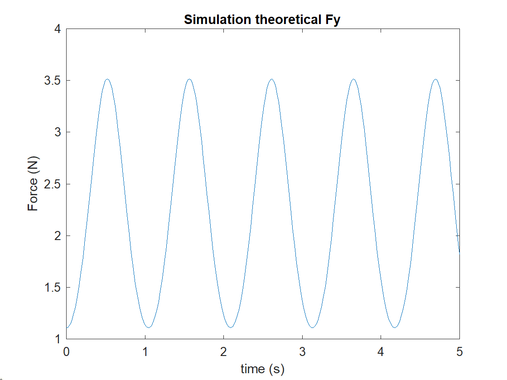

*Figure 22: Measured Fx and Fy forces and simulated Fx and Fy of a pendulum system*

### Experimental Application

To demonstrate the capability of the system, we pushed and pulled on the load cell with a stiff rod and a wire spring. The robotic system was able to respond to the inputs in both cases by moving the attachment point in a desired direction and witnessing the corresponding movement. This was a relatively subjective test since we did not have the time required to fully characterize the system and extract numerical data from this testing, but the load cell was able to accurately relay the direction of the loads applied and the robot was able to move with sufficient accuracy and speed in the direction of the applied loading. See appendix D.1 for a demonstration.

## Continuation

## Future Work

Our current design works at least for a simple demonstration, but there are certainly many things that could be improved, some of which were already being worked on throughout the quarter but didn't get completed for various reasons. Most of these reasons were simply time constraints, though logistics and budget were also important in some cases.

The easiest and most worked on improvement is simply collecting more data and using it to build a more accurate linear regression model. We designed and implemented a setup to automatically perform static loading tests at a controlled sequence of angles, but unfortunately this setup was built without the load cell being mounted to the robot. This meant that we were limited to the much slower method of collecting a series of data points at fixed angles for our final demonstration, resulting in a less accurate model and more tedious data collection and processing. In the future, we suggest building a rotating platform the robot can be mounted on to enable our original rotating angle tests with the load cell already on the robot. A potential alternative to this approach would be repeatability testing to see if the load cell characteristics do indeed change when it's moved from the testing setup to the robot. If they do not, we may simply be able to reuse our rotating testing setup to collect tared data rather than building a rotating mounting platform for the robot.

Another thing we were unable to finish completely was dynamic testing with a pendulum. We modeled the pendulum dynamics and plotted force components for it over time, and we ran a test with a pendulum load to obtain data to compare with our simulation, but at that time we unfortunately didn't have taring or accurate timestamps implemented for data collection. This meant the best comparison we could do was qualitative, based on the shapes of the graphs. Now that both taring and timestamps are implemented, it would be relatively easy to simply redo the test and collect a new set of data to be used with our more current model which is also based on tared data. This would give us a quantitative comparison between the two, which would be useful for determining the load cell's effectiveness at measuring dynamic loads.

Yet another in-progress improvement is torque measurements. Our code has the capacity to model torque relationships if given torque loading data, but we weren't able to collect torque data within our timeframe, so instead we only focus on x and y force components. The linear regression approach should in theory work just as well for torque as it did for x and y forces, the main missing piece is just the calibration data required to get the calibration matrix.

In addition to these in-progress improvements, there are several others we have considered but haven't worked on. We could clean up our wiring and make it more robust to prevent breaking the exceedingly fragile load cell wires. We could fine-tune our filters, debouncers, and amplifiers to further clean up the load cell's measurements. We could also replace the premade amplifiers with our own op amp and filter circuits to reduce costs and allow for more fine-tuning. We could even machine our own load cells and apply strain gauges to them manually to allow for making smaller, more reliable, and more sensitive load cells, though this option is likely to be particularly time-consuming and error-prone.

## Logistics

### Part Lists and Budgets

The parts are purchased for each member to develop the sensor and conduct the experiment. This will give better understanding on how the sensor will be set up and any changes that need to be done to improve the design. The costs associated with building one load cell are shown in Table 5 below:

**Table 5: Component lists and budget for a single load cell**

| No. | Item | Price | Qty | Total |
| --- | --- | --- | --- | --- |
| 1 | Arduino UNO R3 | $23.00 | 1 | $23.00 |
| 2 | Wheatstone Amplifier | $19.95 | 2 | $39.90 |
| 3 | 500g Load Cell | $9.95 | 4 | $39.80 |
| 4 | USB A to B Cable M/M, 6 ft, black | $4.35 | 1 | $4.35 |
| 5 | Fasteners | $2.72 | 1 | $2.72 |
| 6 | PLA | $2.00 | 1 | $2.00 |
| 7 | Ribbon Cable | $5.89 | 0.25 | $1.47 |
| Total |  |  |  | $113.24 |

Excluding experimental cost for setup and testing, the goal to build a force sensor under $150 is achieved with a sensor that cost about $114 each. The cost can be brought down even more with cheaper microcontrollers and bulk purchasing of the components if mass produced. Otherwise, the current list is sufficient for the purpose of this project.

### Timeline

The timeline to complete the project is planned in conjunction with the schedule of the team members and the date to receive the components to start testing the load cells once purchased. It is shown as follows:

| Task | Start | End |
| --- | --- | --- |
| Phase 1 Design: Final Design | 4/5/21 | 4/15/21 |
| Phase 1 Design: Purchase of parts | 4/5/21 | 4/9/21 |
| Phase 1 Design: Building the design | 4/9/21 | 4/13/21 |
| Phase 1 Design: Specification of expectation | 4/5/21 | 4/12/21 |
| Phase 1 Design: Filter and gain | 4/5/21 | 4/14/21 |
| Phase 1 Design: Build the experimentation rig | 4/9/21 | 4/23/21 |
| Phase 2 Calibration: Static loading 1D | 4/5/21 | 4/12/21 |
| Phase 2 Calibration: Static loading 2D data | 4/23/21 | 4/28/21 |
| Phase 2 Calibration: Static loading 2D analysis | 4/28/21 | 5/1/21 |
| Phase 2 Calibration: Calibrate filter and gain | 4/5/21 | 4/7/21 |
| Phase 2 Calibration: Pretensioning the bolts | 4/5/21 | 4/8/21 |
| Phase 3 Testing/evaluation: Static Loading 2D | 4/20/21 | 4/25/21 |
| Phase 3 Testing/evaluation: Dynamic Loading 2D | 4/26/21 | 4/30/21 |
| Phase 4 Application/Final Report: Completed Design | 5/10/21 | 5/17/21 |
| Phase 4 Application/Final Report: Completed Software | 4/20/21 | 4/25/21 |
| Phase 4 Application/Final Report: Completed Report | 5/24/21 | 6/7/21 |

Most of the tasks are set to be completed in April but many of them are actually finished in May. All in all, the tasks are completed before the project deadline so it pays off to overestimate the timeline so that each member has the sense of urgency to do the project.

## Continuation

## References

1. Wurman, P. R., D'Andrea, R., & Mountz, M. (2008). *Coordinating Hundreds of Cooperative, Autonomous Vehicles in Warehouses*. AI Magazine, 29(1), 9. https://doi.org/10.1609/aimag.v29i1.2082
2. Wang, Z., & Schwager, M. (2016). *Force-Amplifying N-robot Transport System (Force-ANTS) for cooperative planar manipulation without communication*. The International Journal of Robotics Research, 35(13), 1564-1586. https://doi.org/10.1177/0278364916667473
3. Y. Gombo, A. Tiwari and S. Devasia, *Accelerated-Gradient-Based Flexible-Object Transport With Decentralized Robot Teams*, IEEE Robotics and Automation Letters, vol. 6, no. 1, pp. 151-158, Jan. 2021. https://doi.org/10.1109/LRA.2020.3036569
4. *Wide Supply Range, Rail-to-Rail Output Instrumentation Amplifier, AD8426, Rev. 0*, Analog Devices, 2011. https://www.analog.com/media/en/technical-documentation/data-sheets/AD8426.pdf
5. R. Bajcsy, *Multi-Agent Intelligent Adaptive Coordinated Robotic System*, Defense Technical Information Center, Jan. 1996.

## Appendices

The original report's appendices are long and code-heavy, so the best way to preserve them faithfully is:

- keep the full original appendix material in the [original PDF](../assets/collaborative-load-transport-final-report.pdf),
- summarize what each appendix contains here,
- and selectively pull out especially useful items rather than pasting dozens of pages of raw code into the webpage.

### Appendix A: Theory

Appendix A expands the strain-gauge and Wheatstone-bridge theory behind the load cell. The PDF includes the original circuit and theory figures.

Representative extracted appendix-theory figures:

### Appendix B: Code

Appendix B contains:

- `B.1` Pendulum simulation code
- `B.2` Principal component analysis code
- `B.3` 1-D calibration code
- `B.4` 2-D static load calibration script and helper functions
- `B.5` Arduino sampling code
- `B.6` Debounce code
- `B.7` Servo rotation testing code

The full code remains preserved in the PDF. For the web version, the most useful interpretation is that the appendix documents the project's actual computational stack:

- MATLAB for calibration, simulation, and post-processing
- Arduino for acquisition and live signal handling
- PCA and linear regression for extracting and calibrating force components

### Appendix C: Previous Designs and Sketches

Appendix C contains prior design sketches and iteration artifacts. The extracted image assets for the back half of the report include several appendix figures, but they are best interpreted in context through the PDF layout rather than standalone without captions.

### Appendix D: Demonstration Videos

- Bot movement demo: [https://youtu.be/JSwahNZB86g](https://youtu.be/JSwahNZB86g)

### Appendix E: Additional Testing Results

Appendix E contains additional testing artifacts including:

- raw data of a 0.1 lb ball bearing being loaded onto the hook in the 1D loading case,
- and a 1D cell water test using an 8 gram ramp loading of 25°C water.

## Archive Note

The core report is now represented on this page section by section. The appendices are intentionally summarized rather than fully expanded because the raw code and long appendix material are better preserved in the PDF archive than in a single scrolling webpage.
