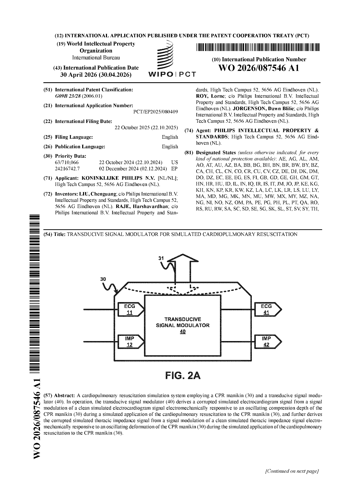

# Projects

These are the projects that best represent the kind of work I want to keep doing: robotics research with real experiments, engineering software that makes specialists faster, and technical prototypes that are useful beyond the demo.

- [Collaborative Load Transport Sensor](collaborative_load_transport.md)

  ---

  Senior capstone on a low-cost multi-axis force sensor for teams of small robots carrying delicate loads together.

- [Racecar LiDAR Benchmarking](racecar_lidar.md)

  ---

  Comparative evaluation of multiple 2D LiDAR odometry pipelines on an RC Ackermann platform with AprilTag and motion-capture ground truth.

- [Shot Peening ML](shotpeening_ml.md)

  ---

  Machine learning system and GUI that approximate deformation outcomes far faster than traditional simulation-only workflows.

- [Crack Detection Pipeline](crack_detection.md)

  ---

  PyTorch-based defect classification pipeline spanning dataset management, training, evaluation, and reproducible inference.

- [Webcam Streaming Stack](webcam_streaming.md)

  ---

  Low-latency, internet-accessible camera setup using Raspberry Pi, Tailscale, and relay-based streaming for remote experiments.

## Patent

  

    
    

      
Published Patent Application

      <h3>Transducive Signal Modulator for Simulated Cardiopulmonary Resuscitation</h3>
      
WO 2026/087546 A1 | Koninklijke Philips N.V.

      

        Named inventor on an electromechanical system that generates realistic CPR-corrupted
        ECG and thoracic-impedance signals on a CPR manikin, producing reproducible synthetic
        data for defibrillator algorithm development and testing.
      

      

        <a href="../assets/patent/WO2026087546A1.pdf" target="_blank">Full PDF</a> ·
        <a href="https://patents.google.com/patent/WO2026087546A1/en" target="_blank">Google Patents</a> ·
        <a href="../experience.md#patents">More in Experience</a>
      

    

  

## What I Optimize For

- Technical depth without losing usability.
- Benchmarks with credible metrics.
- Systems that connect hardware and software cleanly.
- Documentation that makes a project easier to pick up later, even by its original author.
